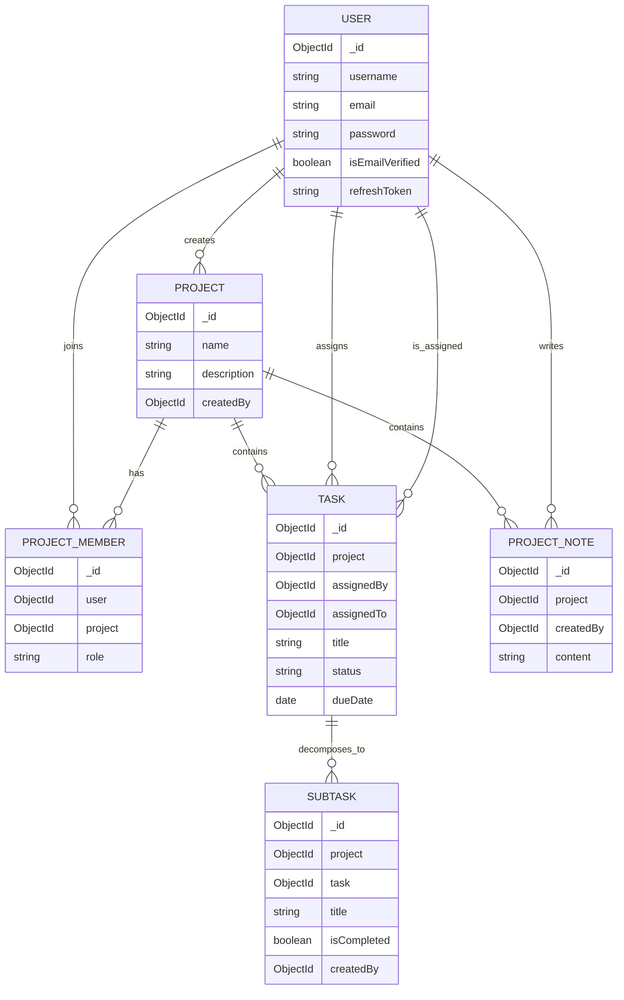

# MaxTeam Backend API

[](https://nodejs.org/)
[](https://expressjs.com/)
[](https://www.mongodb.com/)
[](https://jwt.io/)

MaxTeam is a production-style, multi-tenant project management API (Jira/Asana class) built to solve two hard backend problems: modeling relational workflows in a NoSQL datastore and enforcing strict role-based authorization boundaries across shared resources.

## Elevator Pitch

This system was built to demonstrate senior-level backend engineering decisions:

- Designing $1:N$ and $N:N$ relationships in MongoDB without sacrificing query ergonomics.
- Implementing RBAC that cleanly separates member collaboration rights from administrative/destructive operations.
- Shipping stateless authentication with short-lived access tokens and rotating refresh tokens in HTTPOnly cookies.

## Engineering Highlights

### 1) Data Modeling in MongoDB (Relational Behavior on NoSQL)

Core entities are normalized into independent collections and connected via ObjectId references:

- `Project` stores project metadata and ownership (`createdBy`).
- `ProjectMember` models many-to-many user membership with per-project role (`admin`, `project_admin`, `member`).
- `Task` references `Project` and assignees (`assignedBy`, `assignedTo`) with workflow status.
- `SubTask` references both `Task` and `Project`, preserving parent-child hierarchy while keeping documents small.
- `ProjectNote` is project-scoped and user-attributed, optimized for independent read/write lifecycles.

Modeling tradeoff (referencing vs embedding):

- Referencing is used for tasks/subtasks/notes to avoid unbounded array growth, prevent MongoDB document size pressure, and support targeted updates.
- Embedding is used only for bounded, cohesive task metadata (`links`) where locality improves fetch efficiency.
- This hybrid approach keeps write amplification low while preserving flexible aggregation/population patterns.

### 2) RBAC Enforcement (Authorization, Not Just Authentication)

Authorization is enforced at middleware level before controller execution:

- `isLoggedIn` validates access token from cookies and hydrates `req.user`.
- `validateProjectPermission(roles)` checks membership in `ProjectMember` and gates route access by allowed roles.

Examples of policy boundaries:

- `member` can read project data and contribute (e.g., create notes, update assigned task status).
- `admin`/`project_admin` can create/delete tasks and subtasks.
- `admin` is required for destructive project-level operations (project update/delete, member role management).

This prevents privilege escalation and ensures mutation rights are explicitly role-scoped.

### 3) Secure Session Model (JWT + HTTPOnly Cookies)

Authentication uses a split-token strategy:

- Access token: short TTL (~15 minutes), stored in HTTPOnly cookie.
- Refresh token: longer TTL (~7 days), stored in HTTPOnly cookie and persisted on user record for server-side validation/rotation.

Security posture:

- HTTPOnly cookies reduce direct script access, mitigating token theft via XSS.
- `sameSite` and `secure` flags are environment-aware.
- Refresh flow rotates tokens and rejects stale/invalid refresh tokens.

### 4) Backend Architecture and API Consistency

The codebase follows modular MVC principles:

- Route layer: endpoint definitions + auth/permission middleware.
- Controller layer: request orchestration, policy checks, side effects.
- Model layer: Mongoose schemas and data constraints.
- Utility layer: reusable primitives (`ApiError`, `ApiResponse`, `asyncHandler`).

Result: predictable API envelopes, isolated concerns, and maintainable extension points for notifications, analytics, or auditing.

## System ERD



## Core API Contract

Base URL: `/api/v1`

| Domain          | Endpoint                                | Method     | Auth           | Required Role                                                  |
| --------------- | --------------------------------------- | ---------- | -------------- | -------------------------------------------------------------- |
| Auth            | `/user/register`                        | POST       | No             | Public                                                         |
| Auth            | `/user/login`                           | POST       | No             | Public                                                         |
| Auth            | `/user/refresh-access-token`            | POST       | Refresh cookie | Public session                                                 |
| Auth            | `/user/logout`                          | POST       | Yes            | Any authenticated user                                         |
| Project         | `/project`                              | GET        | Yes            | Any project member                                             |
| Project         | `/project`                              | POST       | Yes            | Authenticated user                                             |
| Project         | `/project/:projectId`                   | GET        | Yes            | `admin`/`project_admin`/`member`                               |
| Project         | `/project/:projectId`                   | PUT        | Yes            | `admin`                                                        |
| Project         | `/project/:projectId`                   | DELETE     | Yes            | `admin`                                                        |
| Project Members | `/project/:projectId/members`           | POST       | Yes            | `admin`                                                        |
| Project Members | `/project/:projectId/members/:memberId` | PUT/DELETE | Yes            | `admin`                                                        |
| Task            | `/task/projects/:projectId/tasks`       | GET        | Yes            | `admin`/`project_admin`/`member`                               |
| Task            | `/task/projects/:projectId/tasks`       | POST       | Yes            | `admin`/`project_admin`                                        |
| Task            | `/task/:projectId/n/:taskId`            | PUT        | Yes            | Role-aware (member restricted to assigned-task status updates) |
| Task            | `/task/:projectId/n/:taskId`            | DELETE     | Yes            | `admin`/`project_admin`                                        |
| SubTask         | `/task/:projectId/n/:taskId/subtasks`   | POST       | Yes            | `admin`/`project_admin`                                        |
| Notes           | `/project-note/:projectId`              | GET        | Yes            | `admin`/`project_admin`/`member`                               |
| Notes           | `/project-note/:projectId`              | POST       | Yes            | `admin`/`member`                                               |
| Notes           | `/project-note/:projectId/n/:noteId`    | PUT/DELETE | Yes            | `admin`                                                        |

## Local Setup

### 1) Prerequisites

- Node.js 18+
- MongoDB Atlas URI or local MongoDB instance

### 2) Install

```bash
git clone https://github.com/mayurbadgujar03/MaxTeam.git
cd MaxTeam
npm install
```

### 3) Configure Environment

Create `.env` at repository root:

```env
PORT=8000
MONGO_URI=<mongodb_connection_string>

ACCESS_TOKEN_SECRET=<strong_random_secret>
ACCESS_TOKEN_EXPIRY=15m
REFRESH_TOKEN_SECRET=<strong_random_secret>
REFRESH_TOKEN_EXPIRY=7d

BASE_URL=http://localhost:5173
NODE_ENV=development

RESEND_API_KEY=<resend_api_key>

# Optional (Socket.IO/CORS override)
# CORS_ORIGIN=http://localhost:5173
```

### 4) Run

```bash
npm run dev
```

Server starts on `http://localhost:8000` (default).

## Why This Project Matters

MaxTeam is intentionally scoped to showcase backend engineering depth beyond CRUD: policy-driven authorization, secure token lifecycle management, and NoSQL schema design for collaborative workload systems.

## Author

Mayur Badgujar

- X: https://x.com/mayurbadgujar36
- LinkedIn: https://www.linkedin.com/in/mayur-badgujar-060a7927b/
