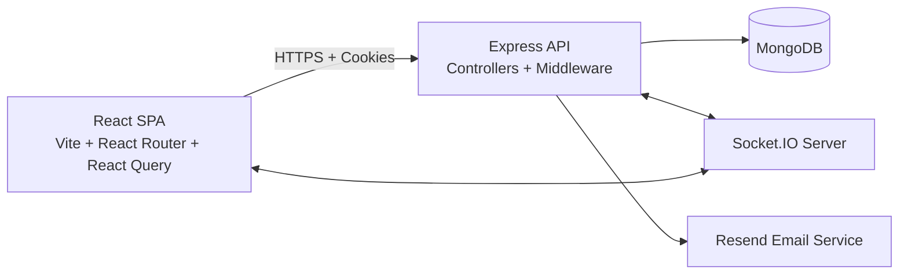
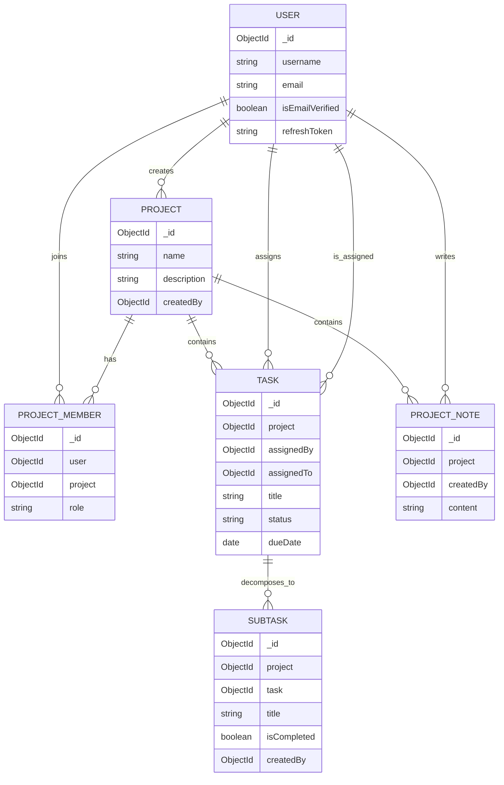

# MaxTeam Full-Stack Architecture

[](https://nodejs.org/)
[](https://expressjs.com/)
[](https://www.mongodb.com/)
[](https://react.dev/)
[](https://vitejs.dev/)
[](https://tanstack.com/query)
[](https://socket.io/)

MaxTeam is a Jira/Asana-style full-stack collaboration platform designed to demonstrate production-grade engineering across both client and server: complex NoSQL data modeling, role-aware authorization, resilient frontend data fetching, and real-time updates.

## Elevator Pitch

This project was built to solve end-to-end SaaS engineering concerns, not just isolated API routes:

- Frontend: architecting a scalable React application with route protection, optimistic data workflows, and socket-driven UI refresh.
- Backend: modeling relational workflows in MongoDB, enforcing RBAC at middleware + controller levels, and implementing secure cookie-based JWT sessions.
- Integration: consistent API contracts, centralized error semantics, and bidirectional real-time signaling for multi-user collaboration.

## System Architecture



## Frontend Engineering Highlights

### 1) Application Composition

- React 18 + Vite SPA with route segmentation for public auth flows and protected product routes.
- Provider stack composes `AuthProvider`, `SocketProvider`, `NotificationProvider`, `ThemeProvider`, and React Query client in a single app shell.
- `ProtectedRoute` ensures authenticated-only access to dashboard, project, profile, and settings routes.

### 2) Data Access and State Consistency

- TanStack React Query is used as the async state layer with cache control (`staleTime`) and retry policies.
- API client centralizes request behavior, always includes credentials, and automatically attempts token refresh on 401 before retrying requests.
- UI feature modules (`projects`, `tasks`, `notes`, `notifications`) consume domain-specific API adapters to keep components thin.

### 3) Real-Time Collaboration UX

- Socket client joins user and project rooms after auth hydration.
- Backend emits `notification_received` and `project_data_updated` events to synchronize project/task/note changes across clients.
- This reduces stale views and enables collaborative awareness without forcing aggressive polling.

## Backend Engineering Highlights

### 1) Data Modeling in MongoDB

Core entities are normalized into reference-based collections:

- `Project`: project ownership and metadata.
- `ProjectMember`: many-to-many relationship with role scoped to project (`admin`, `project_admin`, `member`).
- `Task`: project-scoped work unit with assignment and status.
- `SubTask`: child work unit linked to `Task` and `Project`.
- `ProjectNote`: project-scoped notes with author attribution.

Referencing vs embedding strategy:

- References are used for tasks, subtasks, and notes to avoid unbounded document growth and enable targeted writes.
- Embedding is selectively used for bounded task link metadata for locality and faster fetch paths.

### 2) RBAC Enforcement

- `isLoggedIn` authenticates access token from HTTPOnly cookies and injects `req.user`.
- `validateProjectPermission(roles)` enforces membership and role checks before business logic runs.
- Controller-level constraints add fine-grained policy, for example member-only task status updates on assigned tasks.

### 3) Session Security and Token Lifecycle

- Stateless access tokens and rotating refresh tokens are stored in HTTPOnly cookies.
- Environment-aware `secure` and `sameSite` flags are applied for local vs production behavior.
- Refresh endpoint validates persisted refresh token before issuing a new token pair.

### 4) API Architecture and Reliability

- MVC layering separates routes, controllers, schemas, and shared utilities.
- `ApiError`, `ApiResponse`, and `asyncHandler` enforce consistent response envelopes and predictable error handling.
- CORS and cookie parsing are configured for credentialed cross-origin frontend integration.

## Entity Relationship Model



## Core API Contract

Base URL: `/api/v1`

| Domain          | Endpoint                                | Method     | Auth           | Required Role                    |
| --------------- | --------------------------------------- | ---------- | -------------- | -------------------------------- |
| Auth            | `/user/register`                        | POST       | No             | Public                           |
| Auth            | `/user/login`                           | POST       | No             | Public                           |
| Auth            | `/user/refresh-access-token`            | POST       | Refresh cookie | Public session                   |
| Auth            | `/user/logout`                          | POST       | Yes            | Any authenticated user           |
| Project         | `/project`                              | GET        | Yes            | Any project member               |
| Project         | `/project`                              | POST       | Yes            | Authenticated user               |
| Project         | `/project/:projectId`                   | GET        | Yes            | `admin`/`project_admin`/`member` |
| Project         | `/project/:projectId`                   | PUT        | Yes            | `admin`                          |
| Project         | `/project/:projectId`                   | DELETE     | Yes            | `admin`                          |
| Project Members | `/project/:projectId/members`           | POST       | Yes            | `admin`                          |
| Project Members | `/project/:projectId/members/:memberId` | PUT/DELETE | Yes            | `admin`                          |
| Task            | `/task/projects/:projectId/tasks`       | GET        | Yes            | `admin`/`project_admin`/`member` |
| Task            | `/task/projects/:projectId/tasks`       | POST       | Yes            | `admin`/`project_admin`          |
| Task            | `/task/:projectId/n/:taskId`            | PUT        | Yes            | Role-aware member restrictions   |
| Task            | `/task/:projectId/n/:taskId`            | DELETE     | Yes            | `admin`/`project_admin`          |
| SubTask         | `/task/:projectId/n/:taskId/subtasks`   | POST       | Yes            | `admin`/`project_admin`          |
| Notes           | `/project-note/:projectId`              | GET        | Yes            | `admin`/`project_admin`/`member` |
| Notes           | `/project-note/:projectId`              | POST       | Yes            | `admin`/`member`                 |
| Notes           | `/project-note/:projectId/n/:noteId`    | PUT/DELETE | Yes            | `admin`                          |

## Repository Layout

- `src/`: Node.js + Express backend (controllers, routes, models, middlewares, utils).
- `app/`: React frontend (pages, feature components, contexts, API adapters).

## Local Setup (Backend + Frontend)

### 1) Prerequisites

- Node.js 18+
- MongoDB (Atlas URI or local)

### 2) Install Dependencies

```bash
git clone https://github.com/mayurbadgujar03/MaxTeam.git
cd MaxTeam
npm install
cd app
npm install
```

### 3) Configure Environment

Backend environment in project root `.env`:

```env
PORT=8000
MONGO_URI=<mongodb_connection_string>

ACCESS_TOKEN_SECRET=<strong_random_secret>
ACCESS_TOKEN_EXPIRY=15m
REFRESH_TOKEN_SECRET=<strong_random_secret>
REFRESH_TOKEN_EXPIRY=7d

BASE_URL=http://localhost:5173
NODE_ENV=development

RESEND_API_KEY=<resend_api_key>
```

Frontend environment in `app/.env`:

```env
VITE_API_URL=http://localhost:8000/api/v1
```

### 4) Run Both Apps

Backend (from repository root):

```bash
npm run dev
```

Frontend (from `app/`):

```bash
npm run dev
```

Default local URLs:

- Frontend: `http://localhost:5173`
- Backend API: `http://localhost:8000/api/v1`

## Why This Project Matters

MaxTeam demonstrates full-stack execution quality: a modular React client, an authorization-aware Express API, and a MongoDB schema that supports collaborative workflows with real-time updates and secure session handling.

## Author

Mayur Badgujar

- X: https://x.com/mayurbadgujar36
- LinkedIn: https://www.linkedin.com/in/mayur-badgujar-060a7927b/
